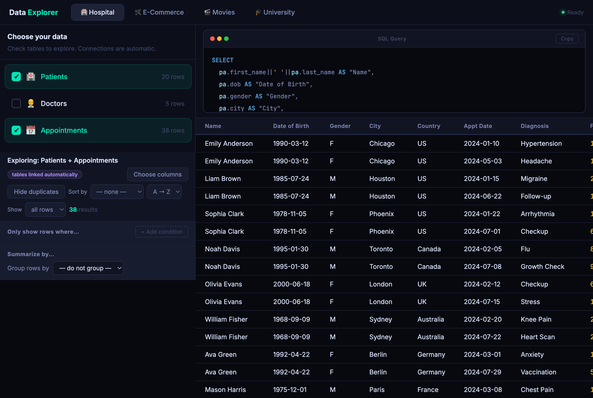

# SQL-Viz-for-Edu

An interactive web app for exploring real datasets — no SQL knowledge needed to use it,
but every action shows the exact SQL query running behind the scenes.

Built for educational purposes to help students connect what they learn in class
to what SQL actually looks like in practice.

Share a specific view with a link: `?db=movies&tables=film,director` pre-selects the database
and tables (table keys are the ones used in the schema, e.g. `patient`, `order_hdr`, `film`).

## How it works

- Pick one or more tables from the left panel
- Use plain-English controls to filter, sort, group, and summarize the data
- Watch the corresponding Oracle-formatted SQL query update live in the code panel
- Copy the query and run it directly in SQL Developer

## Databases included

| Database | Tables | What it covers |
|---|---|---|
| 🏥 Hospital | Patients, Doctors, Appointments | Joins, aggregation, filtering |
| 🛒 E-Commerce | Products, Customers, Orders, Order Items | 4-table joins, self-join |
| 🎬 Movies | Films, Directors, Viewers, Watch History, Tags | Bridge table, LEFT JOIN |
| 🎓 University | Students, Courses, Enrollments | Many-to-many, GROUP BY |

## SQL concepts covered

`SELECT` · `FROM` · `JOIN` · `LEFT JOIN` · `WHERE` · `GROUP BY` · `HAVING` · `ORDER BY` · `DISTINCT` · `COUNT` · `SUM` · `AVG` · `MIN` · `MAX`

## Usage

No installation needed — just open `index.html` in any browser.

**[Live Demo →](https://Nickkklian.github.io/SQL-Viz-for-Edu)**
