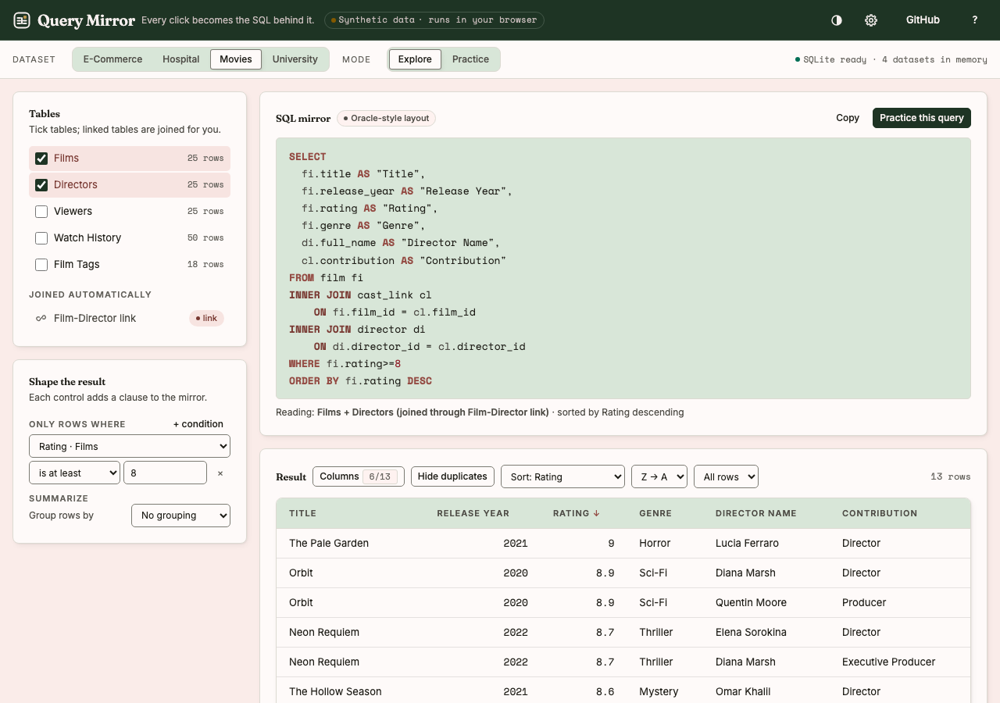
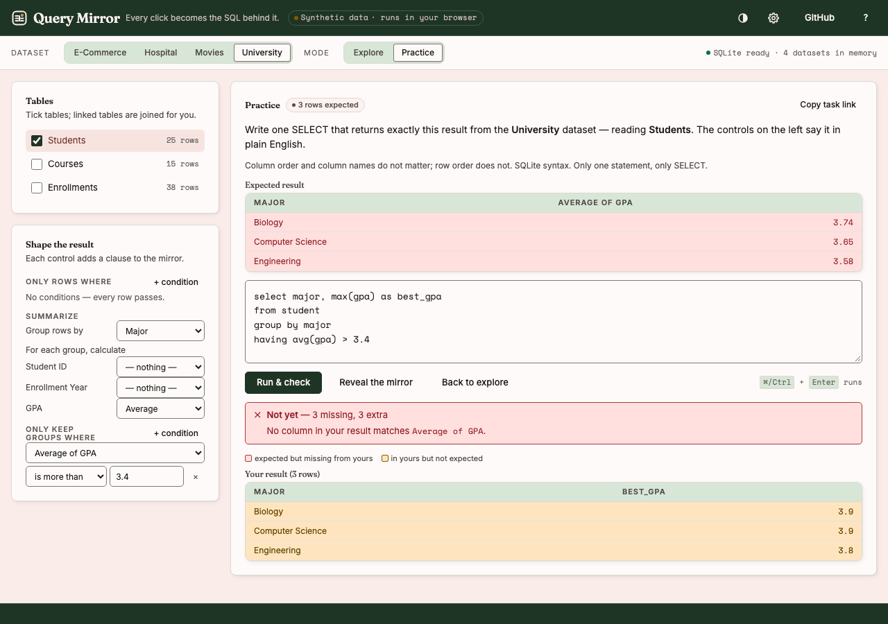
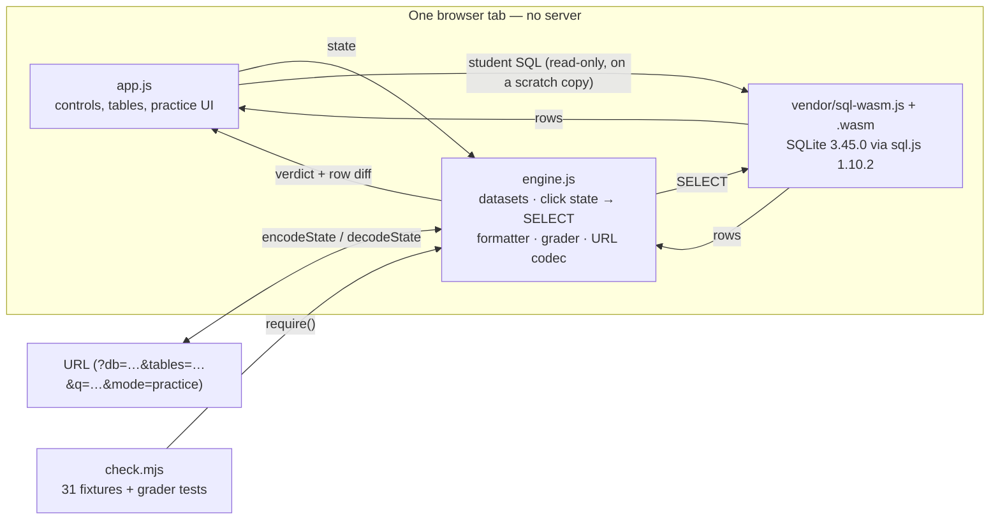

# Query Mirror

**Every click becomes the SQL behind it — a browser-only teaching explorer with a practice mode that grades your own SQL.**



Students pick tables and set conditions in plain English; the mirror shows the single `SELECT` those clicks produce and runs it in SQLite, inside the tab. Practice mode turns it around: it hides the mirror, states the result you have to reproduce, and grades the SQL you write by comparing result sets — so a correct answer written a different way still passes.

**[Open it →](https://nickkklian.github.io/SQL-Viz-for-Edu/)** · no build, no server, no account, nothing uploaded.

## What it does

| | |
|---|---|
| **Explore** | Tick tables (linked tables are joined for you), add conditions, group, summarise, sort, limit. The generated SQL updates on every click and runs immediately. |
| **Practice** | The mirror is hidden. You get the expected result and write the query yourself. `Run & check` grades it and, when wrong, highlights which rows are missing and which are extra. |
| **Share** | The whole state lives in the URL. `Copy task link` gives a link that opens straight into practice mode on the same task. |



## Datasets (synthetic)

| Dataset | Tables | What it is for |
|---|---|---|
| Hospital | Patients, Doctors, Appointments | Two joins through a fact table, aggregation |
| E-Commerce | Products, Customers, Orders, Order Items | Four-table chain, a computed column |
| Movies | Films, Directors, Viewers, Watch History, Tags | Bridge table, `LEFT JOIN`, nullable keys |
| University | Students, Courses, Enrollments | Many-to-many, `GROUP BY` + `HAVING` |

All four are generated for teaching: no real people, companies or patients. They live in `engine.js` as SQL text and are loaded into SQLite in memory when the page opens.

## How it is put together



`engine.js` holds every decision and touches no DOM, so the same code runs in the page and under `node`. That is what makes the generator testable.

## Checks

```bash
node check.mjs
```

It covers the vendored sql.js hashes, the engine loading as a browser global, **31 fixtures** (a click state, its pinned SQL, and the row and column counts it returns when executed in SQLite), the URL codec round-trip, the practice grader (column and row order, renamed columns, NULLs, float tolerance, one-statement rule, naming the wrong column) and page hygiene.

```bash
node check.mjs --break
```

Alters one fixture's SQL and another's row count and must exit non-zero. If it ever passes, the fixture checks are not actually running.

```bash
git show 5316da6:index.html > /tmp/explorer-5316da6.html
node tests/parity.mjs /tmp/explorer-5316da6.html
```

The fixtures pin the behaviour of the explorer this project started as. `tests/parity.mjs` loads the query builder out of that original single-file app (commit `5316da6`), runs it in a sandbox over every fixture state, and requires `engine.js` to produce byte-identical SQL.

CI runs all three on every push (`.github/workflows/check.yml`).

## Self-hosted engine

sql.js 1.10.2 is vendored in `vendor/` rather than loaded from a CDN, so the page keeps working offline, behind a strict CSP, and if the CDN changes. `vendor/SOURCE.md` records the origin and hashes; `check.mjs` re-hashes on every run.

```
sql-wasm.wasm  sha256 4c1c978826062f7b1bb6cc811503863b01415175d0e6dd9ce8a30a81a02c0afb
sql-wasm.js    sha256 3358bb12892642698c0804c85cba48de562bc2de324fe58a422f282832c79c01
```

Both were byte-compared against the npm tarball for sql.js version 1.10.2. `vendor/sql-wasm-b64.js` carries the same wasm bytes as base64, because a page opened from `file://` cannot fetch a sibling `.wasm` — that is why a downloaded copy works by double-clicking `index.html`.

## Limits — what this is not

- **The mirror is Oracle-styled, not Oracle-verified.** The layout and the `ROWNUM` comment match what students see in class, but the text is executed by SQLite and is not run against an Oracle instance. `CAST(… AS TEXT)` and `LIMIT` are SQLite spellings.
- **A teaching subset.** Inner and left joins along fixed schema keys, `WHERE`, `GROUP BY`, `HAVING`, `ORDER BY`, `DISTINCT`, and five aggregates. No subqueries, self-joins, window functions, unions or writes.
- **Grading compares results, not SQL.** A query that returns the right rows by luck passes; an elegant query returning different rows fails. Column names and order are ignored; row order is checked only when the task has a sort.
- **Joins are chosen for you.** Tables are connected along the schema's declared edges by shortest path, so the explorer cannot produce an accidental cross join — and cannot demonstrate one either.
- **Datasets are tiny** (5–50 rows per table). Good for reading a result by eye, useless for anything about performance.

## Run it locally

```bash
git clone https://github.com/NickkkLian/SQL-Viz-for-Edu.git
cd SQL-Viz-for-Edu
```

Then open `index.html` in any browser. There is no install step and no dev server: `index.html`, `engine.js`, `app.js`, the tokens and `vendor/` are the whole app. The checks need Node 20 or newer (CI runs 20 and 22).

## Deep links

| Link | Opens |
|---|---|
| `?db=movies&tables=film,director` | Films joined to directors through the bridge table |
| `?db=university&tables=student` | Students, ready to group |
| `…&mode=practice` | The same state as a practice task |

Older links using only `db` and `tables` still work. Unknown tables or columns in a link are dropped rather than trusted.

MIT · built by Nick Lian
